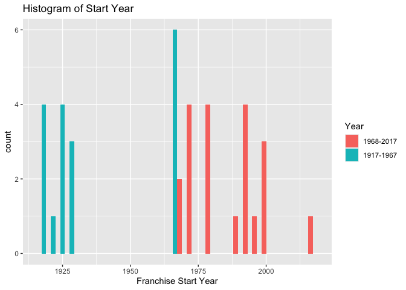
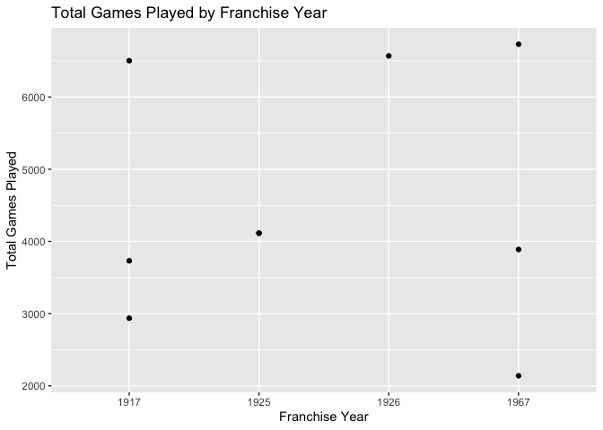
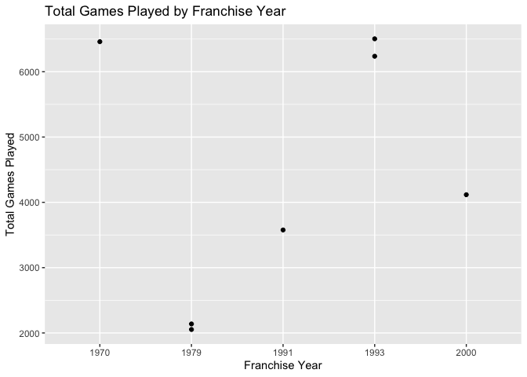
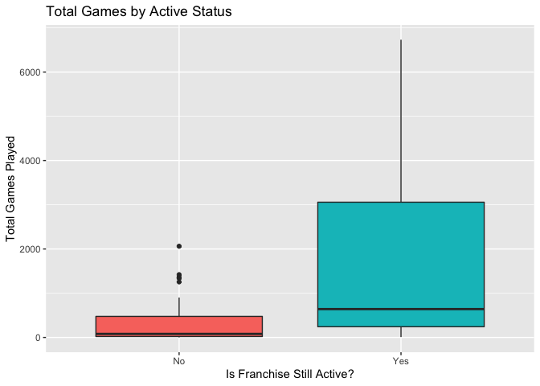
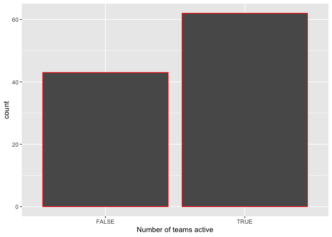

Project 1
================
Ifeoma Ojialor
9/15/2020

  - [Extracting and Accessing the NHL records
    API.](#extracting-and-accessing-the-nhl-records-api.)
  - [Extracting and accessing the NHL stats
    API.](#extracting-and-accessing-the-nhl-stats-api.)
  - [Exploratory Data Analysis.](#exploratory-data-analysis.)

Here are the required libraries needed for this project.

``` r
# required packages 
library(httr)
library(jsonlite)
library(dplyr)
```

    ## Warning: replacing previous import 'vctrs::data_frame' by 'tibble::data_frame'
    ## when loading 'dplyr'

``` r
library(tidyverse)
library(ggplot2)
library(rmarkdown)
```

## Extracting and Accessing the NHL records API.

In this section, I will create the functions needed to contact the NHL
records API and return well parsed data based on their endpoints. Below
is the function needed to access the franchise endpoint. This function
should return the id, firstSeasonId, lastSeasonId, and the name of every
team in the history of the NHL.

``` r
get_fran <- function(tab_name, ID=NULL){
  base_url <- "https://records.nhl.com/site/api"
  full_url <- paste0(base_url, "/", tab_name)
  get_url <- GET(full_url, ID)
  txt_url <- content(get_url, "text")
  franc_data <- fromJSON(txt_url, flatten=TRUE)
  franc_data <- as.data.frame(franc_data)
  if (!is.null(ID)){
    franc_data <- filter(franc_data, ID==ID)
  }
  return(franc_data)
}
```

We also need to create functions to access each of the following
endpoints. Below are the endpoints we need to access in this section.

  - /franchise-team-totals

  - /franchise-season-records?cayenneExp=franchiseId=ID

  - /franchise-goalie-records?cayenneExp=franchiseId=ID

  - /franchise-skater-records?cayenneExp=franchiseId=ID

<!-- end list -->

``` r
get_fran_tot <- function(tab_name, ID){
  if (is.null(ID)){
    stop("Need a valid franchise ID")
  }
  if(!is.numeric(ID)){
    stop("Franchise ID must be a number")
  }
  base_url <- "https://records.nhl.com/site/api"
  full_url <- paste0(base_url, "/", tab_name)
  get_url <- GET(full_url)
  txt_url <- content(get_url, "text")
  ftotal_data <- fromJSON(txt_url, flatten=TRUE)
  ftotal_data <- as.data.frame(ftotal_data)
  return(ftotal_data)
}
```

``` r
get_fran_rec <- function(tab_name, ID){
  if (is.null(ID)){
    stop("Need a valid franchise ID")
  }
  base_url <- "https://records.nhl.com/site/api"
  f_path <- "cayenneExp=franchiseId="
  full_url <- paste0(base_url, "/", tab_name, "?",f_path,as.character(ID))
  get_url <- GET(full_url)
  txt_url <- content(get_url, "text")
  goali_data <- fromJSON(txt_url, flatten=TRUE)
  goali_data <- as.data.frame(goali_data)
  return(goali_data)
}
```

``` r
get_goalie <- function(tab_name, ID){
  if (is.null(ID)){
    stop("Need a valid franchise ID")
  }
  base_url <- "https://records.nhl.com/site/api"
  f_path <- "cayenneExp=franchiseId="
  full_url <- paste0(base_url, "/", tab_name, "?",f_path,as.character(ID))
  get_url <- GET(full_url)
  txt_url <- content(get_url, "text")
  goali_data <- fromJSON(txt_url, flatten=TRUE)
  goali_data <- as.data.frame(goali_data)
  return(goali_data)
}
```

``` r
get_skater <- function(tab_name, ID){
  if (is.null(ID)){
    stop("Need a valid franchise ID")
  }
  base_url <- "https://records.nhl.com/site/api"
  f_path <- "cayenneExp=franchiseId="
  full_url <- paste0(base_url, "/", tab_name, "?",f_path,as.character(ID))
  get_url <- GET(full_url)
  txt_url <- content(get_url, "text")
  skater_data <- fromJSON(txt_url, flatten=TRUE)
  skater_data <- as.data.frame(skater_data)
  return(skater_data)
}
```

## Extracting and accessing the NHL stats API.

Above, we showed how to access the records API. Now, we will show how to
access the NHL stats API and extract information from the teams endpoint
using modifiers. Information about the eight modifiers are listed below;

  - ?expand=team.roster
      - This modifier shows roster of active players for the specified
        team.
  - ?expand=person.names
      - This modifier shows the same as above, but gives less info.
  - ?expand=team.schedule.next
      - This modifier shows the returns details of the upcoming game for
        a team.
  - ?expand=team.schedule.previous
      - This modifier shows the same as above but for the last game
        played.
  - ?expand=team.stats
      - This modifier returns the teams stats for the season.
  - ?expand=team.roster\&season=20142015
      - This modifier shows the roster for that season
  - ?teamId=4,5,29
      - This modifier can string team id together to get multiple teams
  - ?stats=statsSingleSeasonPlayoffs
      - This modifier specifies which stats to get.

<!-- end list -->

``` r
get_stats <- function(tab_name, ID=NULL, mod=NULL){
  base_url <- "https://statsapi.web.nhl.com/api/v1/"
  if (is.null(ID)){
    full_url <- paste0(base_url, "/", tab_name)}
    else {
      full_url <- paste0(base_url, "/", tab_name, "/",ID)}
  if (is.null(mod)){
    full_url <- paste0(base_url, "/", tab_name)}
  get_url <- GET(full_url)
  txt_url <- content(get_url, "text")
  stats_data <- fromJSON(txt_url, flatten=TRUE)
  stats_data <- as.data.frame(stats_data)
  return(stats_data)
}    
```

Now we will create a wrapper function to make it easier to access any of
the API’s done above.

``` r
get_data <- function(endpoint,ID,mod){
if(is.null(endpoint)){stop("Need valid endpoint")}
    else if (endpoint=="franchise_data"){get_franchise_data(ID)}
    else if (endpoint=="franchise_totals"){get_franchise_totals(ID)}
    else if (endpoint=="franchise_records"){get_franchise_records(ID)}
    else if (endpoint=="goalie_records"){get_goalie_records(ID)}
    else if (endpoint=="skater_records"){get_skater_records(ID)} 
    else if (endpoint=="team_stats"){get_stats(ID)} 

}
```

## Exploratory Data Analysis.

Now that we have our data, it is time to make use of that data. In this
section, we will explore our data using plots and summaries.

Suppose we believe that Los Angeles is the country with the most wins.
We can investigate this idea using our data. Let us start with the
franchise data table. We can see that the data involves a span of 100
years(1917 to 2017). Lets investigate whether the amount of games played
every 50 years starting from year 1917 increased or decreased.

``` r
# We can access this data using our get_fran function
fran <- get_fran(tab_name = "franchise")
```

    ## No encoding supplied: defaulting to UTF-8.

``` r
# Now lets perform the necessary transformation and visualize the data
teamData <- separate(fran,data.firstSeasonId,into=c("startYear","Quarter"),sep=4)
teamData <- teamData %>% mutate(Year = "NA") 
teamData$Year <- ifelse(teamData$startYear <= 1967, 1,0)
teamData$Year <- as.factor(teamData$Year)
g <- ggplot(teamData, aes(x = as.numeric(startYear)))
g+geom_histogram(aes(fill = Year), position = "dodge") +xlab("Franchise Start Year") +scale_fill_discrete(labels = c("1968-2017", "1917-1967"))   +labs(title = "Histogram of Start Year")
```

    ## `stat_bin()` using `bins = 30`. Pick better value with `binwidth`.

<!-- -->

From the plot above, we see that more games were played during 1968 -
2017 and less games were played during 1917-1967. Now, lets investigate
the relationship between year and number of games played.

``` r
#Join by franchiseId so that totalGames column is included
d <- get_fran_tot(tab_name = "franchise-team-totals", ID=14)
e<-d %>% inner_join(teamData, by = "data.id")

#create scatter plot of franchise year vs.total games played
y <- filter(e, startYear %in% (1917:1967),data.gamesPlayed > 2000)
g<-ggplot(y,aes(x=startYear,y=data.gamesPlayed))
g+geom_point()+ylab("Total Games Played")+xlab("Franchise Year")+ 
  geom_smooth(method=lm, col="Green") + 
  ggtitle("Total Games Played by Franchise Year")
```

<!-- -->

``` r
z <- filter(e, startYear %in% (1968:2017),data.gamesPlayed > 2000)
g<-ggplot(z,aes(x=startYear,y=data.gamesPlayed))

g+geom_point()+ylab("Total Games Played")+xlab("Franchise Year")+ 
  geom_smooth(method=lm, col="Green") + 
  ggtitle("Total Games Played by Franchise Year")
```

<!-- --> From the
scatterplots above we can infer that there is no linear relationship
between the year and the number of games played. This could be because
the games where played by teams who were not active. It is somewhat
intuitive that there is no relationship between the two variables
because some teams stopped playing as the year passed by. Lets
investigate this hypothesis with the use of a boxplot.

``` r
rangers <- get_fran_tot(tab_name = "franchise-team-totals", ID=14)
```

    ## No encoding supplied: defaulting to UTF-8.

``` r
#Now lets check which is the winning team, we will investigate the team whose wins are greater than losses.
rangers <- mutate(rangers, net_wins = as.numeric(rangers$data.wins - rangers$data.losses))
rangers <- mutate(rangers, net_wins_stats = as.numeric(rangers$data.wins - rangers$data.losses)<0)
rangers <- mutate(rangers, active=is.na(data.lastSeasonId))

g<-ggplot(rangers,aes(x=active))
g+geom_boxplot(aes(y=data.gamesPlayed,fill=active))+theme(legend.position="none")+xlab("Is Franchise Still Active?")+
  ylab("Total Games Played")+labs(title="Total Games by Active Status")+scale_x_discrete(labels=c("No","Yes"))
```

<!-- -->

With this boxplot, we can see that the teams that were active played a
higher number of games than teams that were not active. Recall that were
are interested in the total number of games played by the rangers team.
Lets investigate this further by creating a contingency table of the
wins and losses by a Los Angeles team in 1967.

``` r
#Lets visualize the teams active.
ggplot(rangers, aes(x=active)) + geom_bar(colour = "red") + xlab("Number of teams active")
```

<!-- -->

``` r
#Let us create a contingency table of the Wins and losses of each team.
rangers$net_wins_stats<-str_replace_all(rangers$net_wins_stats, 'TRUE', 'Losing Team')
rangers$net_wins_stats<-str_replace_all(rangers$net_wins_stats, 'FALSE', 'Winning Team')

#maxW <- rangers %>% group_by(data.teamName) %>% summarise(mean(net_wins_stats))
tbl <- table(rangers$data.teamName,rangers$net_wins_stats)
knitr::kable(tbl)
```

|                         | Losing Team | Winning Team |
| :---------------------- | ----------: | -----------: |
| Anaheim Ducks           |           0 |            2 |
| Arizona Coyotes         |           2 |            0 |
| Atlanta Flames          |           1 |            1 |
| Atlanta Thrashers       |           2 |            0 |
| Boston Bruins           |           1 |            1 |
| Brooklyn Americans      |           1 |            0 |
| Buffalo Sabres          |           1 |            1 |
| Calgary Flames          |           1 |            1 |
| California Golden Seals |           1 |            0 |
| Carolina Hurricanes     |           0 |            2 |
| Chicago Blackhawks      |           1 |            1 |
| Cleveland Barons        |           1 |            0 |
| Colorado Avalanche      |           0 |            2 |
| Colorado Rockies        |           2 |            0 |
| Columbus Blue Jackets   |           2 |            0 |
| Dallas Stars            |           0 |            2 |
| Detroit Cougars         |           2 |            0 |
| Detroit Falcons         |           2 |            0 |
| Detroit Red Wings       |           0 |            2 |
| Edmonton Oilers         |           0 |            2 |
| Florida Panthers        |           2 |            0 |
| Hamilton Tigers         |           1 |            0 |
| Hartford Whalers        |           2 |            0 |
| Kansas City Scouts      |           1 |            0 |
| Los Angeles Kings       |           2 |            0 |
| Minnesota North Stars   |           2 |            0 |
| Minnesota Wild          |           1 |            1 |
| Montréal Canadiens      |           0 |            2 |
| Montreal Maroons        |           1 |            1 |
| Montreal Wanderers      |           1 |            0 |
| Nashville Predators     |           1 |            1 |
| New Jersey Devils       |           0 |            2 |
| New York Americans      |           2 |            0 |
| New York Islanders      |           0 |            2 |
| New York Rangers        |           1 |            1 |
| Oakland Seals           |           2 |            0 |
| Ottawa Senators         |           1 |            1 |
| Ottawa Senators (1917)  |           0 |            2 |
| Philadelphia Flyers     |           0 |            2 |
| Philadelphia Quakers    |           1 |            0 |
| Phoenix Coyotes         |           1 |            1 |
| Pittsburgh Penguins     |           0 |            2 |
| Pittsburgh Pirates      |           2 |            0 |
| Quebec Bulldogs         |           1 |            0 |
| Quebec Nordiques        |           2 |            0 |
| San Jose Sharks         |           1 |            1 |
| St. Louis Blues         |           1 |            1 |
| St. Louis Eagles        |           1 |            0 |
| Tampa Bay Lightning     |           0 |            2 |
| Toronto Arenas          |           1 |            1 |
| Toronto Maple Leafs     |           1 |            1 |
| Toronto St. Patricks    |           2 |            0 |
| Vancouver Canucks       |           2 |            0 |
| Vegas Golden Knights    |           0 |            2 |
| Washington Capitals     |           1 |            1 |
| Winnipeg Jets           |           1 |            1 |
| Winnipeg Jets (1979)    |           2 |            0 |

From above, we see that more teams are active , we see that we have a
couple of teams who won a game atleast twice. Lets investigate this
further by looking at teams who are active and won a game atleast twice.

``` r
# Lets investigate the winning teams that are active  

rangers2 <- rangers %>% mutate(active=is.na(data.lastSeasonId)) %>% group_by(data.teamName)
table(rangers2$data.teamName, rangers2$active)
```

    ##                          
    ##                           FALSE TRUE
    ##   Anaheim Ducks               0    2
    ##   Arizona Coyotes             0    2
    ##   Atlanta Flames              2    0
    ##   Atlanta Thrashers           2    0
    ##   Boston Bruins               0    2
    ##   Brooklyn Americans          1    0
    ##   Buffalo Sabres              0    2
    ##   Calgary Flames              0    2
    ##   California Golden Seals     1    0
    ##   Carolina Hurricanes         0    2
    ##   Chicago Blackhawks          0    2
    ##   Cleveland Barons            1    0
    ##   Colorado Avalanche          0    2
    ##   Colorado Rockies            2    0
    ##   Columbus Blue Jackets       0    2
    ##   Dallas Stars                0    2
    ##   Detroit Cougars             2    0
    ##   Detroit Falcons             2    0
    ##   Detroit Red Wings           0    2
    ##   Edmonton Oilers             0    2
    ##   Florida Panthers            0    2
    ##   Hamilton Tigers             1    0
    ##   Hartford Whalers            2    0
    ##   Kansas City Scouts          1    0
    ##   Los Angeles Kings           0    2
    ##   Minnesota North Stars       2    0
    ##   Minnesota Wild              0    2
    ##   Montréal Canadiens          0    2
    ##   Montreal Maroons            2    0
    ##   Montreal Wanderers          1    0
    ##   Nashville Predators         0    2
    ##   New Jersey Devils           0    2
    ##   New York Americans          2    0
    ##   New York Islanders          0    2
    ##   New York Rangers            0    2
    ##   Oakland Seals               2    0
    ##   Ottawa Senators             0    2
    ##   Ottawa Senators (1917)      2    0
    ##   Philadelphia Flyers         0    2
    ##   Philadelphia Quakers        1    0
    ##   Phoenix Coyotes             2    0
    ##   Pittsburgh Penguins         0    2
    ##   Pittsburgh Pirates          2    0
    ##   Quebec Bulldogs             1    0
    ##   Quebec Nordiques            2    0
    ##   San Jose Sharks             0    2
    ##   St. Louis Blues             0    2
    ##   St. Louis Eagles            1    0
    ##   Tampa Bay Lightning         0    2
    ##   Toronto Arenas              2    0
    ##   Toronto Maple Leafs         0    2
    ##   Toronto St. Patricks        2    0
    ##   Vancouver Canucks           0    2
    ##   Vegas Golden Knights        0    2
    ##   Washington Capitals         0    2
    ##   Winnipeg Jets               0    2
    ##   Winnipeg Jets (1979)        2    0

We can see that some teams are active while some are not. Lets obtain
quantitative summaries of number of games played for each team.

``` r
stats<-rangers2 %>% group_by(active, data.teamName) %>% summarise(averageGames=mean(data.gamesPlayed), medGame= median(data.gamesPlayed), maxGame = max(data.gamesPlayed)) %>% arrange(desc(maxGame))
```

    ## `summarise()` regrouping output by 'active' (override with `.groups` argument)

``` r
stats
```

    ## # A tibble: 57 x 5
    ## # Groups:   active [2]
    ##    active data.teamName       averageGames medGame maxGame
    ##    <lgl>  <chr>                      <dbl>   <dbl>   <int>
    ##  1 TRUE   Montréal Canadiens         3745    3745     6731
    ##  2 TRUE   Boston Bruins              3617    3617     6570
    ##  3 TRUE   Chicago Blackhawks         3526    3526     6504
    ##  4 TRUE   New York Rangers           3511    3511     6504
    ##  5 TRUE   Toronto Maple Leafs        3499    3499     6460
    ##  6 TRUE   Detroit Red Wings          3428.   3428.    6237
    ##  7 TRUE   St. Louis Blues            2258.   2258.    4117
    ##  8 TRUE   Los Angeles Kings          2186.   2186.    4116
    ##  9 TRUE   Philadelphia Flyers        2282    2282     4115
    ## 10 TRUE   Pittsburgh Penguins        2250    2250     4115
    ## # … with 47 more rows

Alternatively, we can create boxplots;

``` r
g<-ggplot(rangers2,aes(x=active))
g+geom_boxplot(aes(y=data.gamesPlayed,fill=active))+theme(legend.position="none")+xlab("Is Franchise Still Active?")+
  ylab("Total Games Played")+labs(title="Total Games by Active Status")+scale_x_discrete(labels=c("No","Yes"))
```

<!-- --> Based on the
quantitative summaries, we see that Montreal Canadiens from the rangers
played the most games.
